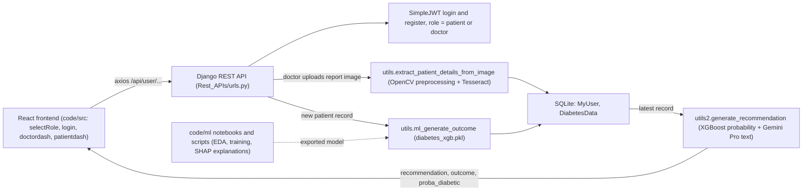

# AI-ENHANCED HEALTHCARE DIAGNOSTICS AND MANAGEMENT SYSTEM INSPIRED BY ZK MEDICAL BILLING PLATFORM

This README provides an overview of the project, including team details, relevant links, tasks completed, tech stack, key features, and steps to run the project locally.

## Team Details

**Team Name:** ERROR 404 : CHANGE FOUND?

**Project Title** - HEALTHCARE MANAGEMENT AND RECOMMENDER SYSTEM 

**Team Leader:** [@HARSHDIPSAHA](https://github.com/HARSHDIPSAHA)

**Team Members:**

- **ANSHUMAN RAJ** - 2023UCD3053 - [@SAVAGECAT05](https://github.com/SAVAGECAT05)
- **HEMANK KAUSHIK** - 2023UEI2867 - [@HEMANKKAUSHIK](https://github.com/HEMANKKAUSHIK)
- **KANISHK SHARMA** - 2023UCD2175 - [@GHOSTDOG007](https://github.com/GHOSTDOG007)
- **ANSHIKA SINGH** - 2023UCA1946 - [@CUBIX33](https://github.com/CUBIX33)
- **HARSHDIP SAHA** - 2023UCA1897 - [@HARSHDIPSAHA](https://github.com/HARSHDIPSAHA)
- **AMAN BIHARI** - 2023UCA1910 - [@CODEBREAKER32](https://github.com/CODEBREAKER32)

**PROJECT DESCRIPTION** - This system addresses the inefficiencies in current healthcare diagnostics and management by implementing AI models that can analyze patient data for more accurate and timely diagnosis, offer predictive insights for preventive care. This automation reduces human error, improves decision-making, and enhances patient care.The project is running fine on local host and the frontend part is deployed.

**TECHNOLOGIES USED** :- <br>
*1. DJANGO* <br>
*2. REACT JS* <br>
*3. SQLite* <br>
*4. PANDAS* <br>
*5. GEMINI* <br>
*6. MATPLOTLIB* <br>
*7. OPENCV* <br>
*8. TESSERACT OCR* <br>
*9. XAI (SHAP)* <br>
*10. XGboost* <br>
## Project Links

- **Internal Presentation:** [Internal Presentation](https://github.com/codebreaker32/SIH_INTERNAL_ROUND_1_ERROR_404_CHANGE_FOUND/blob/main/files/Internal_PPT_ERROR404_CHANGE_FOUND.pdf)
- **Final SIH Presentation:** [Final SIH Presentation](https://github.com/codebreaker32/SIH_INTERNAL_ROUND_1_ERROR_404_CHANGE_FOUND/blob/main/files/SIH_PPT_ERROR404_CHANGE_FOUND.pdf)
- **Video Demonstration:** [Watch Video](https://youtu.be/XL4BwAEqjc4)
- **Live Deployment:** [View Deployment](https://healthy002.netlify.app/)
- **Source Code:** [GitHub Repository](https://github.com/codebreaker32/SIH_INTERNAL_ROUND_1_ERROR_404_CHANGE_FOUND)


## How it works

The repo is a Django REST backend plus a React frontend (both under `code/`), with the ML experiments that produced the diabetes model in `code/ml/`.



Endpoints defined in `code/Rest_APIs/urls.py` (all under `/api/user/`): `register/`, `login/`, `profile/`, `changepassword/`, `logout/`, `get-diabetes-data/`, `doctor/patients/`, `patients/`, `patients/<username>/`.

## Project structure

```
code/
  HealthCare_BACKEND/   Django project (settings, urls, requirements.txt)
  Rest_APIs/            custom user model, JWT views, serializers, utils.py (OCR + XGBoost), utils2.py (Gemini recommendation), diabetes_xgb.pkl
  Data_user/            DiabetesData model and migrations
  ml/                   diabetes.csv, EDA and model notebooks, explainable_ai.py (SHAP), recommend_using_geminipro.py, image_generation_fromcsv.py
  src/, public/         React app (package.json name: medical-portal; react-router-dom, axios, chart.js)
  manage.py, db.sqlite3
  README.md             detailed backend and frontend setup notes
```

## Getting started

Full step-by-step instructions (Windows and macOS) are in [`code/README.md`](code/README.md). In short:

```bash
cd code
pip install -r HealthCare_BACKEND/requirements.txt
python manage.py migrate
python manage.py runserver        # API on http://127.0.0.1:8000

npm install && npm start          # React dev server, from the same code/ folder
```

You also need a local Tesseract install (the path is set in `Rest_APIs/utils.py`) and a Gemini API key (set in `Rest_APIs/utils2.py`).

## Status and limitations

- Hackathon (SIH) prototype; no automated tests beyond the Django/React defaults.
- The Tesseract executable path is hard-coded to a Windows location in `Rest_APIs/utils.py`; the Gemini API key in `utils2.py` is an empty string and must be filled in.
- `patientdash.js` calls `/api/patient/`, `/api/analytics/` and `/api/recommendations/`, which are not defined in `Rest_APIs/urls.py` (the code comments mark them as placeholders); the doctor dashboard and login use the real endpoints.
- The `code/ml/` scripts read local CSVs (`diabetes_outcome.csv`, `patient_details.csv`) by relative path and are run standalone, not from the API.
- `node_modules/` and `db.sqlite3` are committed to the repository.
